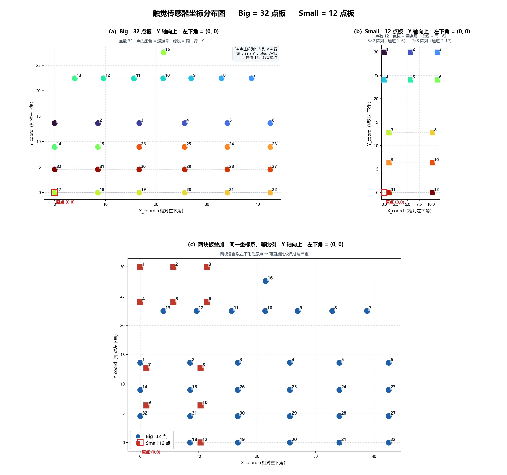
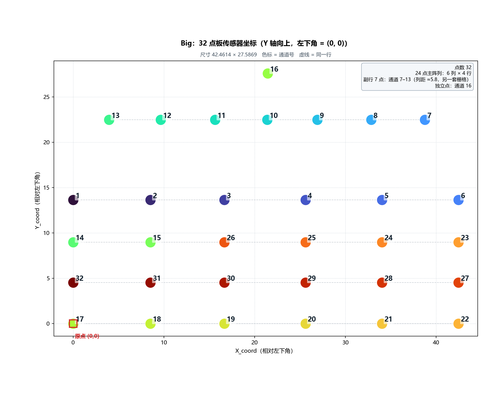
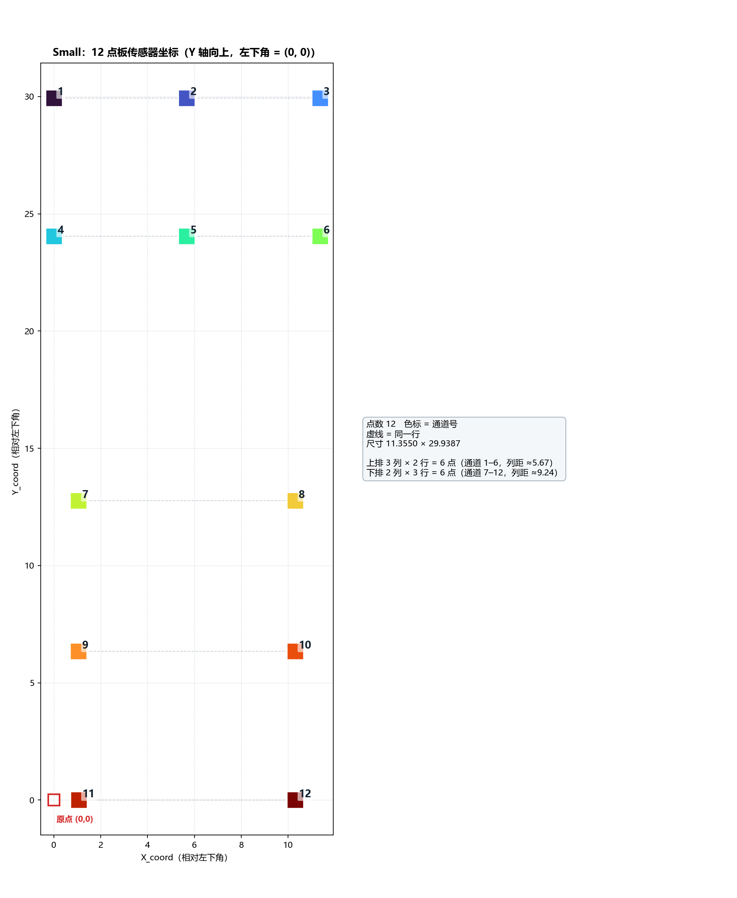

# 触觉传感器坐标图（Big 32 点 / Small 12 点）

生成时间：2026-09-11 21:24　|　坐标方向：**Y 轴向上**　|　**每块板左下角 = (0, 0)**

| 板 | 点数 | 平移量 (x_min, y_min) | 原点化后尺寸 宽 × 高 | 原始数据 SHA-256（前 16 位） |
|---|---:|---|---|---|
| Big 32 点 | 32 | (127.531, 55.6552) | 42.4614 × 27.5869 | `71dec34cf0a3b85e` |
| Small 12 点 | 12 | (105.8507, 71.1159) | 11.3550 × 29.9387 | `8bac68b0fdcc92e6` |

**本页所有坐标都是「左下角 = (0, 0)」的平移结果**：平移量 = 该板自己的 (x_min, y_min)，**只平移、不缩放、不旋转、不镜像**。12 点板与 32 点板用的是同一套规则，所以两板对齐到同一原点后可以直接比尺寸和节距。

原始绝对坐标（与 CSV 逐字一致）仍完整保留在常量模块的 `*_COORDS` / `*_XY` 里，随时可以取回。

---

## 一、图形版

> 三个面板都是**等比例**（1 单位 X = 1 单位 Y），形状未被拉伸；生成时逐面板校验 `ratio = 1.0000`。

### 1.1 总览



### 1.2 Big 32 点板



### 1.3 Small 12 点板



---

## 二、纯文本坐标图（不依赖图片）

字符列按比例对应 X、字符行按比例对应 Y（Y 轴向上），**原点在左下角**。**数字 = Big 板通道号，字母 = Small 板通道号**（A=1 … L=12）。
左侧刻度只标「该行真实存在的点」的 Y 值，空行不带刻度。

> 文字版只保证「列↔X、行↔Y 各自的比例关系」，两个方向是独立缩放的，所以它是**位置示意**，不是等比例图；等比例请看上面的 PNG。

### 2.1 Big 32 点板

```text
      X→  0    5   10   15  20   25  30   35  40
            ───────────────────────────────────────
27.59 │                   16
         │
22.47 │    13   12   11   10   9     8    7
         │
         │
         │
13.64 │1       2      3       4       5       6
         │
8.97 │14      15     26      25      24      23
         │
4.52 │32      31     30      29      28      27
         │
         │
0.00 │17      18     19      20      21      22
```

坐标范围：X 0.00 ~ 42.46　Y 0.00 ~ 27.59（原点化）

### 2.2 Small 12 点板

```text
      X→  0    5   10
            ────────────
29.94 │1    2    3
         │
         │
24.04 │4    5    6
         │
         │
         │
         │
12.76 │ 7       8
         │
         │
6.34 │ 9       10
         │
         │
0.00 │ 11      12
```

坐标范围：X 0.00 ~ 11.36　Y 0.00 ~ 29.94（原点化）

### 2.3 两块板叠加（各自左下角对齐到 (0, 0)）

```text
      X→  0      5      10     15      20     25     30     35     40
            ────────────────────────────────────────────────────────────
29.94 │A       B       C
         │
27.59 │                               16
         │
         │
         │
24.04 │D       E       F
22.47 │      13      12      11       10     9        8       7
         │
         │
         │
         │
         │
         │
         │
         │
13.64 │1           2           3            4           5           6
12.76 │  G            H
         │
         │
         │
8.97 │14          15          26           25          24          23
         │
         │
6.34 │  I            J
4.52 │32          31          30           29          28          27
         │
         │
         │
         │
0.00 │17K         18 L        19           20          21          22
```

坐标范围：X 0.00 ~ 42.46　Y 0.00 ~ 29.94（原点化）

> 读法提醒：两板共用原点后，Small 的 11 号 (1.058, 0.0004) 与 Big 的 17 号 (0, 0) 只差约 1 个单位，文字版里会紧挨着显示（`17K` = Big 的 17 + Small 的 K，`18 L` = Big 的 18 + Small 的 L）。字母是 Small、数字是 Big，位置本身没有挪动。

两板共用同一个原点，所以可以直接比较：**Big 宽 42.46、Small 宽 11.36**，高度接近（27.59 / 29.94）。

---

## 三、逐行坐标表（左下角 = (0, 0)）

行按 Y 升序（第 1 行在最下面，与图中 Y 轴向上一致）。通道号按 X 从左到右。X 从 0 起算。

### 3.1 Big 32 点板

| 行 | Y | 点数 | 通道号（左 → 右） | 逐个 X | 列间距 |
|---:|---:|---:|---|---|---|
| 1 | 0.0000 | 6 | `17 18 19 20 21 22` | 0.00 8.51 16.66 25.60 34.04 42.46 | 8.51 / 8.15 / 8.94 / 8.44 / 8.43 |
| 2 | 4.5245 | 6 | `32 31 30 29 28 27` | 0.00 8.51 16.66 25.60 34.04 42.46 | 8.51 / 8.15 / 8.94 / 8.44 / 8.43 |
| 3 | 8.9750 | 6 | `14 15 26 25 24 23` | 0.00 8.51 16.66 25.60 34.04 42.46 | 8.51 / 8.15 / 8.94 / 8.44 / 8.43 |
| 4 | 13.6408 | 6 | `1 2 3 4 5 6` | 0.00 8.51 16.66 25.60 34.04 42.46 | 8.51 / 8.15 / 8.94 / 8.44 / 8.43 |
| 5 | 22.4717 | 7 | `13 12 11 10 9 8 7` | 3.95 9.63 15.62 21.38 26.91 32.84 38.76 | 5.68 / 5.99 / 5.75 / 5.53 / 5.93 / 5.92 |
| 6 | 27.5869 | 1 | `16` | 21.45 | — |

### 3.2 Small 12 点板

| 行 | Y | 点数 | 通道号（左 → 右） | 逐个 X | 列间距 |
|---:|---:|---:|---|---|---|
| 1 | 0.0002 | 2 | `11 12` | 1.06 10.30 | 9.24 |
| 2 | 6.3410 | 2 | `9 10` | 1.06 10.30 | 9.24 |
| 3 | 12.7638 | 2 | `7 8` | 1.06 10.30 | 9.24 |
| 4 | 24.0372 | 3 | `4 5 6` | 0.00 5.67 11.36 | 5.67 / 5.69 |
| 5 | 29.9387 | 3 | `1 2 3` | 0.00 5.67 11.36 | 5.67 / 5.69 |

---

## 四、结构分析

### 4.1 Big 32 点板 = 24 点主阵列 + 7 点副行 + 1 个独立点

- **主阵列 6 列 × 4 行 = 24 点**：通道 `1, 2, 3, 4, 5, 6, 14, 15, 17, 18, 19, 20, 21, 22, 23, 24, 25, 26, 27, 28, 29, 30, 31, 32`。
  X 轴 14 个取值里有 6 个属主阵列，列距 ≈ 8.5；Y 为 55.6552 / 60.1797 / 64.6302 / 69.2960，行距 ≈ 4.5 → 单元格约 **8.5 × 4.5**。
- **副行 7 点**：通道 `7, 8, 9, 10, 11, 12, 13`，Y = 22.4717，列距 ≈ 5.8，与主阵列不是同一套栅格。
- **独立点**：通道 16 在 (21.4465, 27.5869)，两套栅格都对不上。

### 4.2 Small 12 点板 = 两块不同节距的子阵列

- **上排 3 列 × 2 行 = 6 点**：通道 `1, 2, 3, 4, 5, 6`，列距 ≈ 5.67。
- **下排 2 列 × 3 行 = 6 点**：通道 `7, 8, 9, 10, 11, 12`，列距 ≈ 9.24。

> 原始数据里通道 11 的 Y = 71.1163、通道 12 的 Y = 71.1159，相差 0.0004；原点化后分别是 0.0004 和 0.0000。两者视为同一行，表中该行 Y 取平均 0.0002（`SMALL_12_ROWS_REL` 的定义如此）。

### 4.3 两板关系（原点化后可直接比较）

| 项 | Big 32 点 | Small 12 点 |
|---|---|---|
| 平移量 (x_min, y_min) | (127.531, 55.6552) | (105.8507, 71.1159) |
| 尺寸 宽 × 高 | 42.4614 × 27.5869 | 11.3550 × 29.9387 |
| X 取值个数 | 14 | 6 |
| Y 取值个数（行数） | 6 | 6 |
| 主节距 | 列 ≈8.5 / 行 ≈4.5（主阵列）<br>副行 列 ≈5.8 | 上排 列 ≈5.67<br>下排 列 ≈9.24 |

两板共用同一个原点（各自左下角），所以可以直接看：**Big 明显更宽（42.5 vs 11.4）**，高度接近（27.6 vs 29.9）。

原始绝对坐标下两板的 X 区间是**不重叠**的（`BIG_AND_SMALL_X_OVERLAP = False`），Small 整体在 Big 左侧约 10 个单位 —— 这一点在原点化后不再体现，如需查看请用 `--raw` 出图。

---

## 五、常量模块 `sensor_coords.py`

坐标已写成 Python 常量，上位机可直接 import，不需要再解析 CSV：

```python
from sensor_coords import (
    # 原始绝对坐标（与 CSV 逐字一致）
    BIG_32_COORDS, SMALL_12_COORDS,        # ((通道号, X, Y), ...) 通道号 1..N
    BIG_32_XY, SMALL_12_XY,                # {通道号: (X, Y)}
    BIG_32_BOUNDS, SMALL_12_BOUNDS,        # (x_min, x_max, y_min, y_max)
    # 左下角 = (0, 0) 的原点化坐标
    BIG_32_COORDS_REL, SMALL_12_COORDS_REL,
    BIG_32_XY_REL, SMALL_12_XY_REL,
    BIG_32_ORIGIN, SMALL_12_ORIGIN,        # 被减掉的平移量
    BIG_32_SIZE, SMALL_12_SIZE,            # 宽 × 高
    BIG_32_BOUNDS_REL, SMALL_12_BOUNDS_REL,  # (0, 0, 宽, 高)
    # 栅格与结构
    BIG_32_X_AXIS, BIG_32_Y_AXIS, BIG_32_ROWS, BIG_32_ROWS_REL,
    BIG_32_MAIN_CHANNELS, BIG_32_SIDE_ROW, BIG_32_STANDALONE,
    SMALL_12_TOP_CHANNELS, SMALL_12_BOTTOM_CHANNELS,
    # 工具
    xy_for, xy_rel_for, coords_for, coords_rel_for,
    origin_for, size_for, bounds_for, bounds_rel_for, normalized_xy,
)

xy_for(17, 32)       # -> (127.531, 55.6552)   原始绝对坐标
xy_rel_for(17, 32)   # -> (0.0, 0.0)           Big 板左下角就是它
xy_rel_for(7, 32)    # -> (38.7583, 22.4717)   副行最右（原点化）
normalized_xy(32)    # -> {通道号: (u, v)}，u = X/宽, v = Y/高
```

| 常量 | 含义 |
|---|---|
| `BIG_32_COORDS` / `SMALL_12_COORDS` | **原始绝对坐标**，逐字来自 CSV |
| `BIG_32_COORDS_REL` / `SMALL_12_COORDS_REL` | **左下角 = (0, 0)** 的坐标 |
| `*_ORIGIN` | 该板被减掉的平移量 `(x_min, y_min)` |
| `*_SIZE` / `*_BOUNDS_REL` | 原点化后的宽高与包围盒 `(0, 0, 宽, 高)` |
| `*_XY` / `*_XY_REL` / `COORDS*_BY_CHANNEL_COUNT` | 按通道号 / 按通道数索引 |
| `*_BOUNDS` / `*_X_AXIS` / `*_Y_AXIS` | 原始包围盒与栅格轴 |
| `*_ROWS` / `*_ROWS_REL` | 逐行分组 `(Y, (通道号...))`，行内按 X 左→右 |
| `BIG_32_MAIN_CHANNELS` / `BIG_32_SIDE_ROW` / `BIG_32_STANDALONE` | Big 板三段结构 |
| `SMALL_12_TOP_CHANNELS` / `SMALL_12_BOTTOM_CHANNELS` | Small 板两块子阵列 |

除原始坐标外，其余常量全部**由原始表推导**（包括平移后的相对坐标），改原始表即自动同步，不会出现数据与派生值不一致。

---

## 六、待确认项

1. **Y 轴方向**：本图按「Y 轴向上」绘制。若来源是图像/屏幕坐标（Y 向下），跑 `python plot_coords.py --flip` 即可上下镜像；上位机可用 `normalized_xy(32, y_up=False)` 直接拿到屏幕坐标。
2. **`sensor_Number` 的口径**：是 MCU 原始通道 `ch01–ch32`，还是网页显示位置 `CH01–CH32`？后者需套 `嵌入式代码/Applications/Tactile500/docs/BOARD_VARIANTS_AND_CHANNEL_MAP.md` 里的短线换序表 `SHORT_POSITION_TO_CHANNEL`。

## 七、重新生成

```powershell
python make_sensor_coords.py            # CSV  ->  sensor_coords.py（常量）
python plot_coords.py                   # 常量 ->  PNG（左下角 = (0,0)）
python plot_coords.py --raw             # 常量 ->  PNG（原始绝对坐标）
python plot_coords.py --flip            # 常量 ->  PNG（Y 轴向下）
python plot_coords.py --verify-csv      # 校验常量与 CSV 逐字一致
python make_coord_md.py                 # 常量 ->  本 Markdown
python sensor_coords.py                 # 常量模块自检
```

`plot_coords.py` 会逐面板校验等比例（`ratio` 必须为 `1.0000`）以及说明框覆盖的数据点数（必须为 `0`）。
